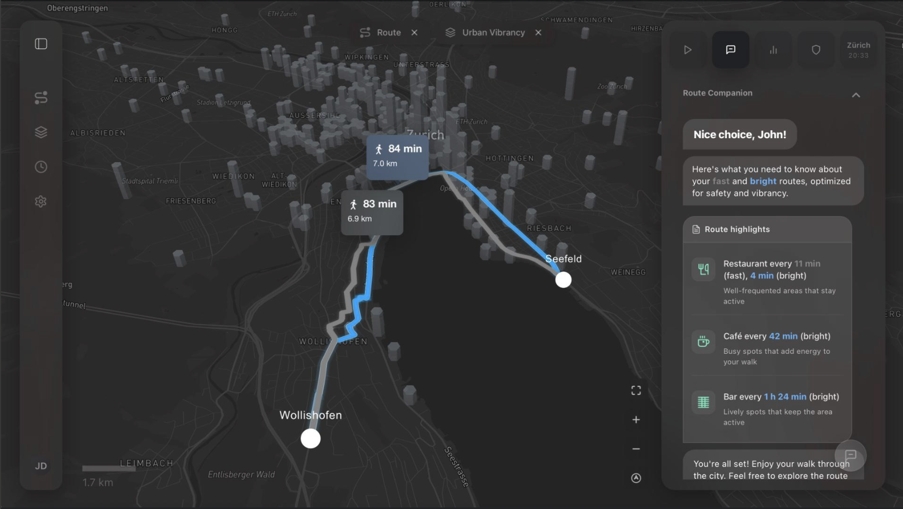
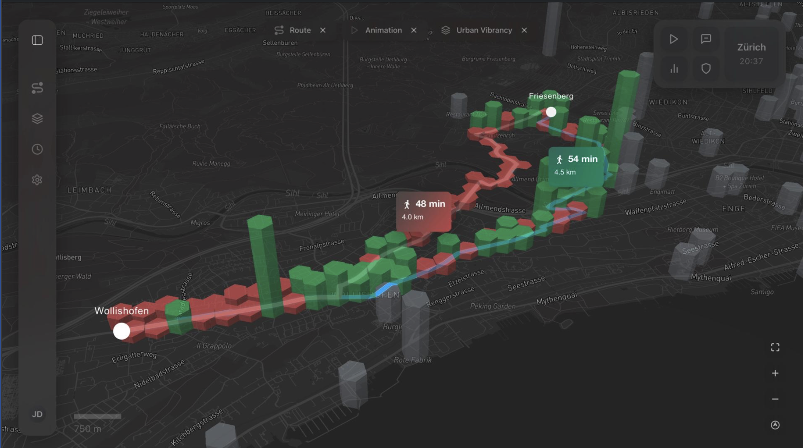
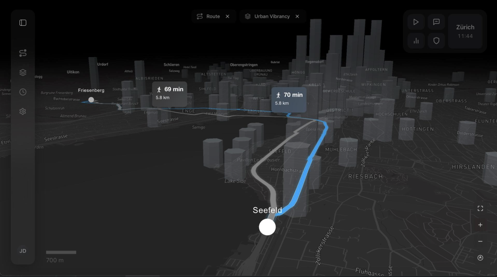
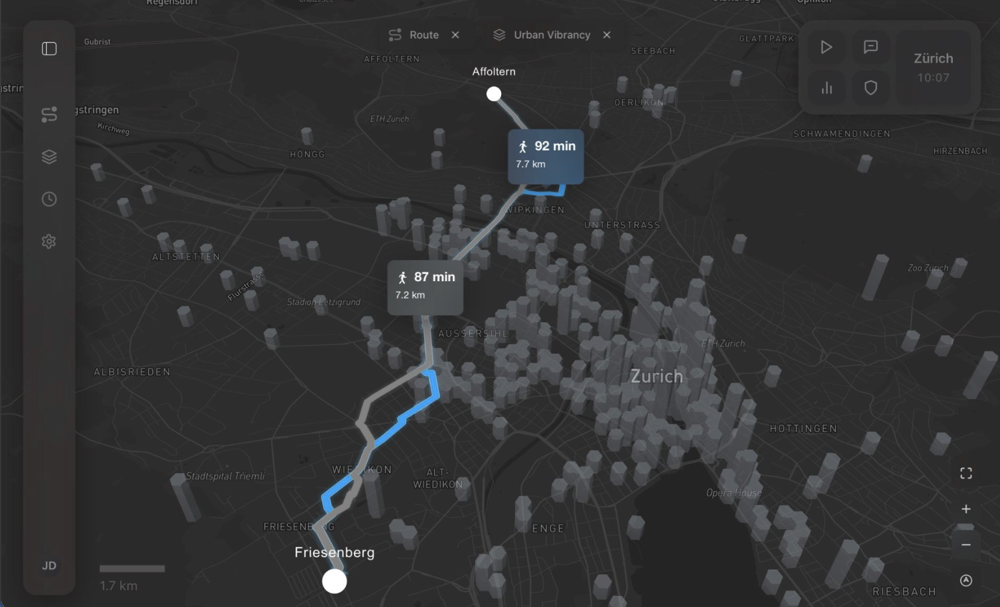

# Lumo – Walk the (b)right Way

> Nighttime pedestrian routing for Zürich, weighted by street lighting and urban activity. Built with Vue 3, Mapbox GL JS and Cesium.


> [!NOTE]
> Lumo is live at https://ikgcartoapps.ethz.ch/project/trogenmoser/

**Code repository:** https://gitlab.ethz.ch/ikgcartoapps-hs24/trogenmoser

## About

Lumo is an interactive web-based map application that supports nighttime pedestrian navigation in the city of Zürich. While conventional navigation tools primarily optimize routes based on distance and travel time, Lumo focuses on perceptual aspects of urban space that become particularly relevant after dark, such as street lighting and visible social activity.

The application visualizes open data on public street lighting and nighttime-related points of interest to highlight areas that feel brighter and more vibrant at night. Based on this information, Lumo offers comfort-oriented walking route suggestions that prioritize well-lit and socially active streets over purely shortest paths. Rather than making claims about safety, the application aims to increase transparency and support informed, comfort-based route choices.

The project lies at the intersection of cartography, urban perception, and user experience design, and demonstrates how digital maps can support more human-centered navigation experiences in nighttime urban environments.

## Screenshots

### Interactive Routing Interface
Main application view showing comfort-weighted route selection with contextual UI controls.



### Animated Comfort-Weighted Routing
Dynamic route visualization illustrating comfort levels along the path using animated 3D map elements.



### 3D Route Perspective View
Oblique 3D map perspective highlighting route geometry and spatial comfort variations.



### Minimal Map Interaction Mode
Map view with collapsed UI to maximize spatial context and routing visibility.



## Features

**Visualisation**
- **Lighting Intensity** as a hexagonal choropleth conveying continuous brightness patterns.
- **Urban Vibrancy** as 3D hexbars whose height encodes relative nighttime activity.
- **Combined Score**, a bivariate layer where colour encodes lighting and height encodes vibrancy.

**Routing**
- Comfort-weighted routes between routing hubs, each available as a faster (`_f`) and a brighter (`_b`) variant, precomputed for every hub-to-hub combination (36 origin–destination pairs).
- A **Lumo score** (0–10) summarising how much of a route passes through brighter, more active areas.
- Route comparison that contrasts the fast and bright option hexagon by hexagon.
- Animated route playback where hexagons light up along the path, coloured relative to the city-wide median score.
- **Security-alert overlays** that highlight route segments passing through lower-scoring areas, plus a **taxi/ride recommendation** for those stretches.

**Exploration and UI**
- **Hotspot Explorer** for nine nightlife areas (Altstetten, Bahnhof, Bellevue, Central, Enge, Hardbrücke, Langstrasse, Niederdorf, Oerlikon), each with neighbourhood imagery.
- A 2D **Mapbox GL** map and an alternative 3D **Cesium** globe view.
- A dark, minimalist interface with a sidebar, an interactive legend, a guided tour, and a first-load walkthrough.

## Tech Stack

| Layer | Library / Tool |
|---|---|
| UI framework | Vue 3 |
| Primary map engine | Mapbox GL JS |
| 3D globe viewer | Cesium |
| Build tool | Vite |
| Linting & formatting | ESLint, Prettier |
| Geoprocessing | Python (shapely, geopandas, pyproj), QGIS |

## Data Processing

The thematic layers and walking routes are computed offline so the web client stays light and responsive. All datasets are open data from the City of Zürich and swisstopo, harmonised to a common coordinate reference system before processing.

1. **Grid** - a 100 m × 100 m hexagonal grid covering the municipal area (`hex_light_100m`, `hex_vibrancy_100m`, `lumo_score`), generated in QGIS.
2. **Aggregation** - lighting points and points of interest aggregated to cells, producing brightness and activity values per cell.
3. **Scoring** - values normalised and combined into a single `combined_score`; a city-wide median (`hexagon_median.json`) splits cells into brighter and dimmer areas.
4. **Routing** - for each hub-to-hub route (fast and bright), a set of Python scripts in `public/data/scripts/` precomputes the derived data the frontend loads at runtime:

| Script | Output |
|---|---|
| `calculate_hexagon_median.py` | Median `combined_score`, used to colour hexagons in the animation |
| `calculate_route_hexagon_intersections.py` | Hexagons each route passes through |
| `calculate_route_lumo_scores.py` | Per-route Lumo score (share of brighter hexagons) |
| `calculate_route_security_alerts.py` | Route segments crossing lower-scoring areas |
| `calculate_route_stats.py` | Route length, walking duration, and POI counts/frequency |
| `calculate_hotspot_distances.py` | Distances and walking times from hotspots to the nearest hubs |

The pipeline outputs preprocessed GeoJSON and JSON.

### Data Sources

| Description | Source |
|---|---|
| Zürich communal boundary | https://www.stadt-zuerich.ch/geodaten/download/95 |
| Public illumination (points) | https://data.stadt-zuerich.ch/dataset/geo_oeffentliche_beleuchtung_der_stadt_zuerich |
| Night clubs (points) | https://data.stadt-zuerich.ch/dataset/zt_nachtleben |
| Bars and lounges (points) | https://data.stadt-zuerich.ch/dataset/zt_bars |
| Gastronomy (points) | https://data.stadt-zuerich.ch/dataset/zt_gastronomie |
| Street network for routing | https://www.swisstopo.admin.ch/de/landeskarte-swiss-map-vector10 |

## Web Application

The application is built with Vue 3 and Vite. Mapbox GL JS provides the interactive 2D map, Cesium powers an alternative 3D globe view, and the codebase keeps application state, map logic, and user interface cleanly separated.

### Setup

**Prerequisites:** Node.js and npm.

Install dependencies:

```bash
npm install
```

Create a `.env` file in the project root and add your Mapbox access token:

```
VITE_MAPBOX_TOKEN=your_mapbox_token_here
```

Start the development server (opens at `http://localhost:3000`):

```bash
npm run dev
```

**Other scripts:**

| Command | Description |
|---|---|
| `npm run build` | Compile and bundle for production |
| `npm run preview` | Preview the production build at `http://localhost:3010` |
| `npm run lint` | Run ESLint across all source files |
| `npm run prettier` | Auto-format all files with Prettier |

> Note: `vite.config.js` sets `base` to the deployment path (`/project/trogenmoser/`) for hosting on `ikgcartoapps.ethz.ch`. Adjust it if you deploy elsewhere.

## Code Structure

### Root

| File | Description |
|---|---|
| `index.html` | Vite HTML entry point; mounts the Vue app to `#app` |
| `vite.config.js` | Vite configuration: Vue plugin, Cesium static-asset copy, dev/preview ports, production base path, manual Cesium chunk |
| `.gitlab-ci.yml` | Two-stage GitLab CI/CD: build, then manual deploy to `ikgcartoapps.ethz.ch` |
| `assets/uber.jpg` | Image used by the taxi/ride recommendation UI |

### `src/`

| File | Description |
|---|---|
| `main.js` | Creates the Vue application instance and mounts it to the DOM |
| `App.vue` | Root component; owns global UI state (sidebar, layer and route selection, popups, overlays) and orchestrates the map and panels |
| `cesium.js` | Configures a swisstopo WMTS imagery provider for the Cesium globe |
| `style.css` | Global stylesheet: dark theme, typography, controls, and loading states |

### `src/components/`

| File | Description |
|---|---|
| `MapboxViewer.vue` | Primary Mapbox GL map; renders the lighting, vibrancy, combined, route, hub and hotspot layers, and drives route animation and security-alert overlays |
| `CesiumViewer.vue` | Alternative 3D globe view (Cesium) showing routing hubs and hexagon data |
| `Legend.vue` | Interactive legend for the active layer mode, with colour gradients, statistics, and the hotspot-explorer list |
| `GuidedTour.vue` | Multi-step onboarding dialog with animated transitions |
| `Walkthrough.vue` | First-load welcome toast |
| `MapboxTest.vue` | Minimal Mapbox test component (development only) |

### `public/data/`

| Path | Description |
|---|---|
| `lumo_score.geojson`, `hex_light_100m.geojson`, `hex_vibrancy_100m.geojson`, `hexagon_median.json` | 100 m hexagon grid with lighting, vibrancy and combined scores, plus the median used for colouring |
| `lighting_locations.*`, `vibrancy_points.geojson`, `combined_locations.json` | Point datasets and a merged index used by the search UI |
| `hubs/`, `routing_hubs.geojson` | Routing hub locations |
| `routes/`, `routes_wgs84/` | Route geometries (source, and WGS 84 fast/bright variants) |
| `route_intersections/`, `route_lumo_scores/`, `route_comparisons/`, `route_security_alerts/`, `route_taxi_recommendations/` | Precomputed per-route data for every hub-to-hub pair |
| `hotspots_wgs84/`, `*_hotspots.json` | Nightlife hotspot areas |
| `scripts/` | Python preprocessing scripts and their `requirements.txt` |

### `public/SVG/`

UI icons (routing, sidebar, layer toggles, the Lumo logo) and nine neighbourhood photographs for the hotspot areas.

## Attributions

**Data:** Open geodata from the City of Zürich (public street lighting, nightlife and gastronomy points of interest, communal boundary) and swisstopo (pedestrian street network).

**Basemaps:** © Mapbox © OpenStreetMap © swisstopo

## Credits

Created by **Timm Rogenmoser** for the course **Application Development in Cartography (103-0227-00L)** at ETH Zürich, Autumn Semester 2025. Course lead: Dr. Andreas Neumann.

## AI-Assisted Development

Cursor AI was used as a coding assistant during development to generate and refine code suggestions. All AI-generated suggestions were reviewed, adapted, and integrated by the author. The overall application architecture, data processing workflow, and core functionality were designed and implemented by the author.
